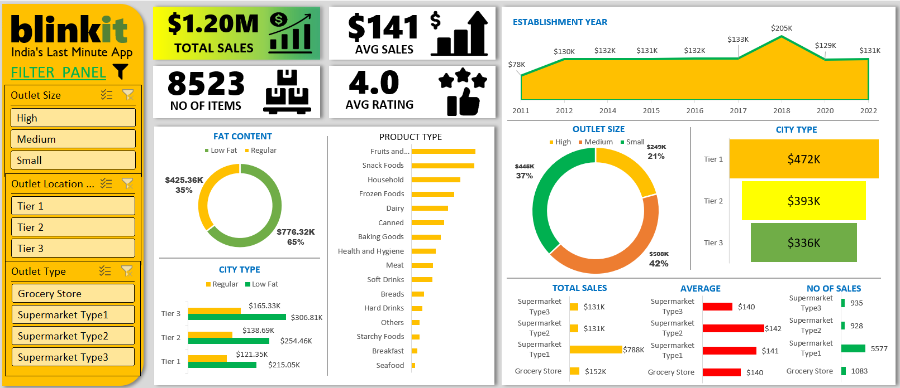
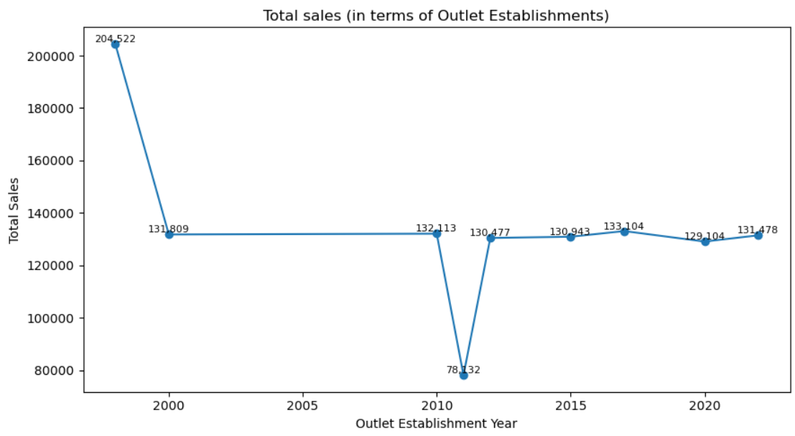
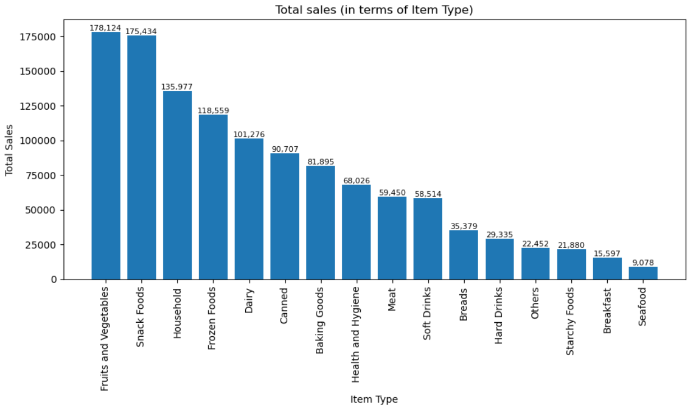
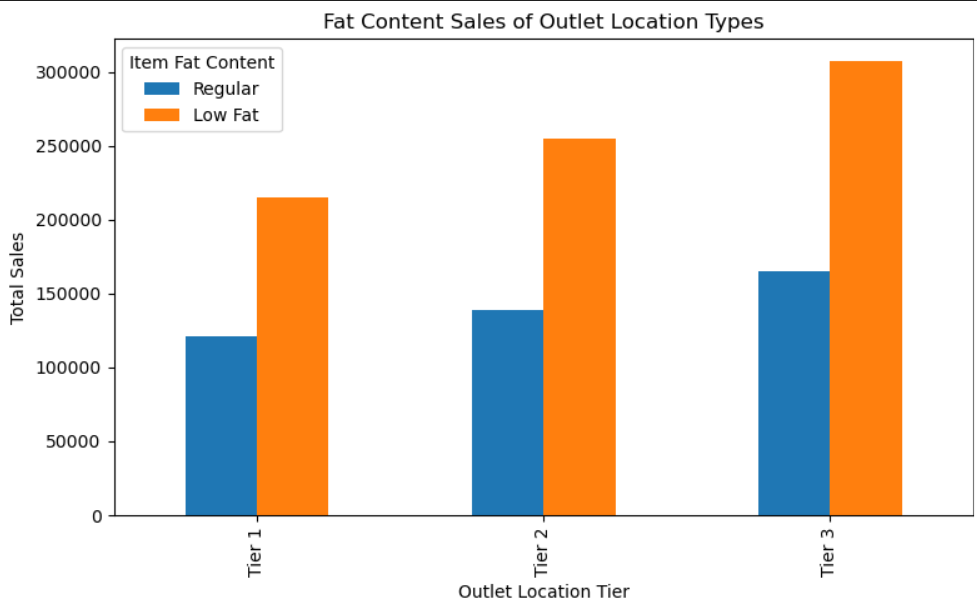

# BlinkIt_Sales_Analytics

Business/Data Analyst project analyzing BlinkIt sales data using Python, SQL, Excel, and Power BI to extract insights on product performance, outlet trends, and customer preferences.

> One dataset → Multiple approaches (Python, SQL, Excel, Power BI) to show data wrangling, analysis, and visualization skills.

---

## 🔧 What it does
- Cleaned and analyzed BlinkIt sales dataset with **Python (Pandas, NumPy, Seaborn, Matplotlib)**  
- Wrote **SQL queries** for aggregation, pivoting, and sales insights (e.g., category share, outlet performance)  
- Built **Excel dashboard** summarizing revenue, sales distribution, and top-performing products  
- Developed an **interactive Power BI dashboard** for business reporting and decision-making  
- Delivered **actionable insights** such as:
  - Low Fat vs Regular items contribution to total sales  
  - Top categories driving revenue share  
  - Outlet size and type correlation with sales performance  

---

## 🖼️ Demo
  

 


---

## 📊 Sample SQL Queries
```sql
-- Total sales in millions
SELECT CAST(SUM(Total_Sales) / 1000000 AS DECIMAL(10, 2)) AS Total_Sales_Millions
FROM blinkit_data;

-- Sales distribution by item type
SELECT Item_Type, SUM(Total_Sales) AS Total_Sales
FROM blinkit_data
GROUP BY Item_Type
ORDER BY Total_Sales DESC;
